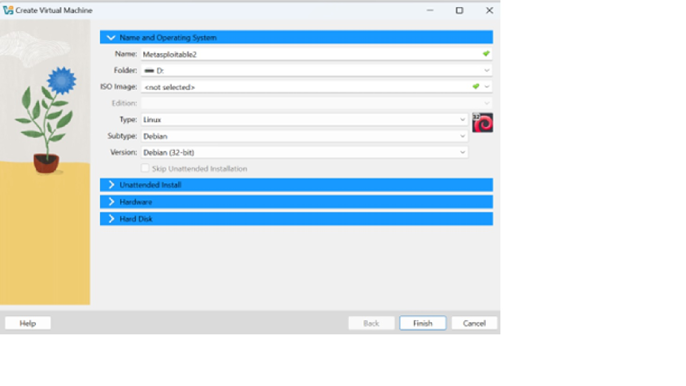

# Metasploitable-2-Lab-Environment-Setup

## Lab Environment Setup

## Overview

As part of my hands-on cybersecurity learning journey, I am building an isolated vulnerability assessment lab using Kali Linux and Metasploitable 2.

Metasploitable 2 is an intentionally vulnerable Linux virtual machine designed for security testing and education.

The purpose of this project is to develop practical skills in:

- Network reconnaissance
- Port scanning
- Service enumeration
- Vulnerability assessment
- Security analysis
- Risk identification
- Remediation

All testing in this project is performed against an intentionally vulnerable virtual machine in my controlled lab environment.

---

## Lab Architecture

```text
                    Kali Linux
                Security Testing VM
                       |
                       |
                Isolated Lab Network
                       |
                       |
                 Metasploitable 2
                Vulnerable Target VM
```


## Tools Used

| Tool              | Purpose                          |
|-------------------|----------------------------------|
| Kali Linux        | Security testing and assessment  |
| Metasploitable 2  | Intentionally vulnerable target  |
| Oracle VirtualBox | Virtualization platform          |
| Nmap              | Network reconnaissance and enumeration |

---

## Objectives

The objectives for this lab are:

1. Download and import Metasploitable 2.
2. Configure the virtual machine in VirtualBox.
3. Attach the supplied Metasploitable `.vmdk` disk.
4. Allocate appropriate system resources.
5. Configure the virtual network.
6. Start the Metasploitable 2 virtual machine.
7. Identify its IP address.
8. Verify communication between Kali Linux and Metasploitable 2.

## Virtual Machine Configuration

### Metasploitable 2

| Configuration | Details |
|---|---|
| Operating System | Linux |
| VirtualBox Profile | Debian (32-bit) |
| Base Memory | 1024 MB |
| Virtual Disk | Metasploitable 2 `.vmdk` |
| Role | Vulnerable target machine |



### Kali Linux

Kali Linux is being used as the security testing machine.

The following tools will be used throughout the assessment:

- Nmap
- FTP client
- Netcat
- Searchsploit
- Other Kali Linux security tools as required

