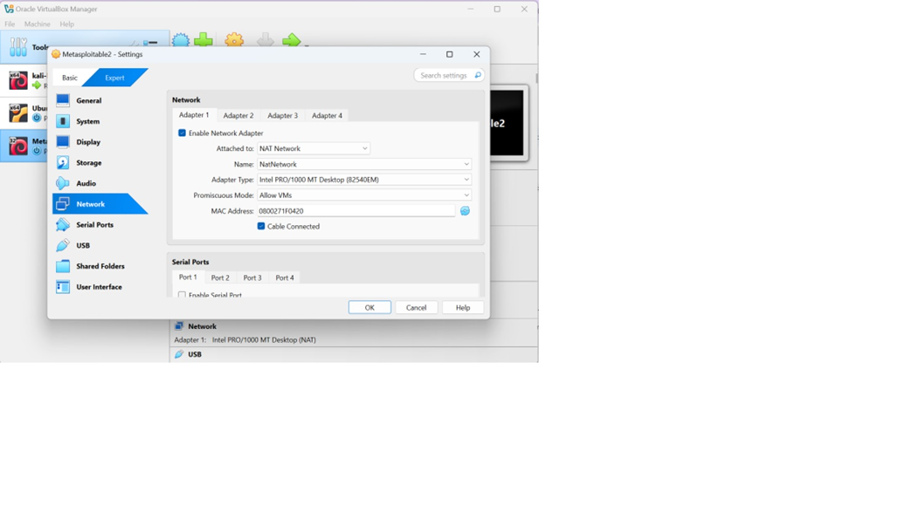
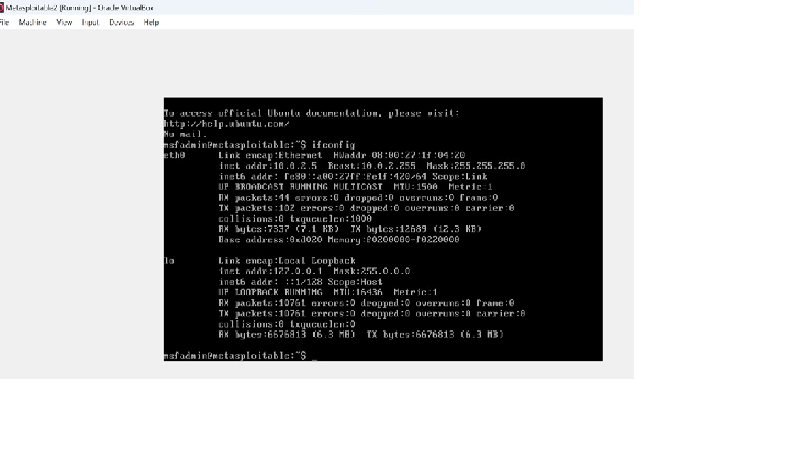
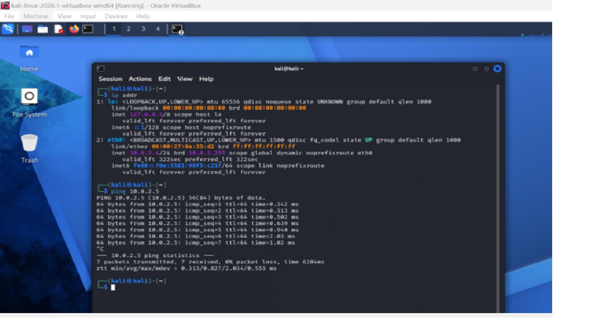
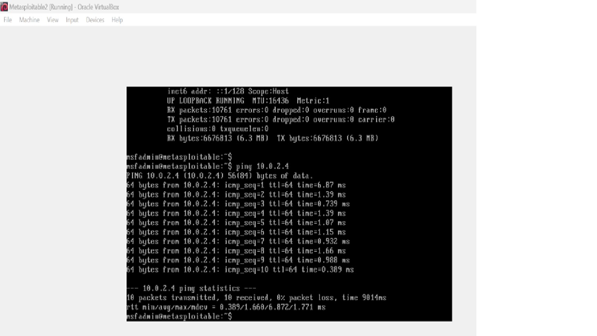

# Metasploitable-2-Lab-Environment-Setup

## Lab Environment Setup

## Overview

As part of my hands-on cybersecurity learning journey, I am building an isolated vulnerability assessment lab using Kali Linux and Metasploitable 2.

Metasploitable 2 is an intentionally vulnerable Linux virtual machine designed for security testing and education.

The purpose of this project is to develop practical skills in:

- Network reconnaissance
- Port scanning
- Service enumeration
- Vulnerability assessment
- Security analysis
- Risk identification
- Remediation

All testing in this project is performed against an intentionally vulnerable virtual machine in my controlled lab environment.

---

## Lab Architecture

```text
                    Kali Linux
                Security Testing VM
                       |
                       |
                Isolated Lab Network
                       |
                       |
                 Metasploitable 2
                Vulnerable Target VM
```


## Tools Used

| Tool              | Purpose                          |
|-------------------|----------------------------------|
| Kali Linux        | Security testing and assessment  |
| Metasploitable 2  | Intentionally vulnerable target  |
| Oracle VirtualBox | Virtualization platform          |
| Nmap              | Network reconnaissance and enumeration |

---

## Objectives

The objectives for this lab are:

1. Download and import Metasploitable 2.
2. Configure the virtual machine in VirtualBox.
3. Attach the supplied Metasploitable `.vmdk` disk.
4. Allocate appropriate system resources.
5. Configure the virtual network.
6. Start the Metasploitable 2 virtual machine.
7. Identify its IP address.
8. Verify communication between Kali Linux and Metasploitable 2.

## Virtual Machine Configuration

### Metasploitable 2

| Configuration | Details |
|---|---|
| Operating System | Linux |
| VirtualBox Profile | Debian (32-bit) |
| Base Memory | 1024 MB |
| Virtual Disk | Metasploitable 2 `.vmdk` |
| Role | Vulnerable target machine |


### Kali Linux

Kali Linux is being used as the security testing machine.

The following tools will be used throughout the assessment:

- Nmap
- FTP client
- Netcat
- Searchsploit
- Other Kali Linux security tools as required

## Network Configuration

The Metasploitable 2 virtual machine was connected to the isolated lab network so that it could communicate with Kali Linux.

I identified the IP address of the Metasploitable 2 machine using:

```bash```
ifconfig





The IP address displayed by the machine was used as the target address for subsequent testing.

## Connectivity Test from Kali Linux to Metasploitable 2

From Kali Linux, I tested connectivity to the Metasploitable 2 target using the `ping` command.

```bash
ping 10.0.2.5 and ping 10.0.2.4
```



A successful response confirmed that Kali Linux could communicate with the Metasploitable 2 target over the lab network.

## Security Considerations

Metasploitable 2 is intentionally vulnerable and should not be exposed directly to the public internet.

The virtual machine is being used strictly as a controlled cybersecurity training target.

The lab environment should remain isolated from:

- Production systems
- Personal devices
- Sensitive networks
- Public-facing networks

This helps ensure that security testing remains controlled and authorized.

## What I Learned

- Deploy Metasploitable 2 in Oracle VirtualBox.
- Configure a vulnerable Linux target.
- Configure the virtual network.
- Identify the target machine's IP address.
- Test network connectivity between the two systems.
- Prepare an isolated environment for vulnerability assessment.
- Organize evidence and screenshots for cybersecurity documentation.

## Ethical / Lab Disclaimer

All activities documented in this project were performed in my own controlled cybersecurity laboratory using intentionally vulnerable systems for educational purposes.

No unauthorized systems or networks were targeted.

## Author

**Nkemjika Omazi**

CompTIA Security+ Certified | Cybersecurity Hands-on Labs
